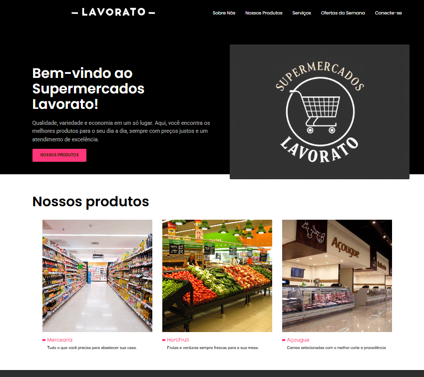

### 🛒 **Supermercados Lavorato**  

Bem-vindo ao repositório do **Supermercados Lavorato**! Este é um projeto de um site responsivo desenvolvido com **HTML** e **CSS**, com foco em praticar estruturação de páginas e estilização sem o uso de frameworks.  

---

## 📌 **Sobre o Projeto**  
O **Supermercados Lavorato** é um site fictício criado para treinar habilidades em desenvolvimento web. Ele contém diversas seções essenciais para um supermercado, incluindo:  

✅ **Página Inicial** – Apresentação do mercado e ofertas em destaque.  
✅ **Produtos** – Lista de produtos disponíveis.  
✅ **Serviços** – Informações sobre serviços oferecidos.  
✅ **Ofertas** – Promoções e descontos especiais.  
✅ **Sobre Nós** – História e valores da empresa.  
✅ **Contato** – Formulário e informações para clientes.  

---

## 🛠 **Tecnologias Utilizadas**  
- **HTML5** – Estruturação das páginas.  
- **CSS3** – Estilização e responsividade.  
- **Font Awesome** – Ícones para melhorar a experiência do usuário.  

---

## 🚀 **Como Executar o Projeto**  

1️⃣ **Clone o repositório**  
```sh
git clone https://github.com/seu-usuario/supermercados-lavorato.git
```  

2️⃣ **Abra o arquivo `index.html` no navegador** ou utilize um servidor local como o **Live Server (VS Code)** para melhor experiência.  

---

## 📷 **Imagens do Projeto** 


